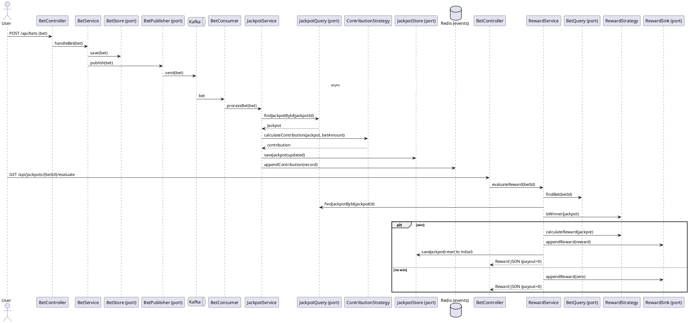
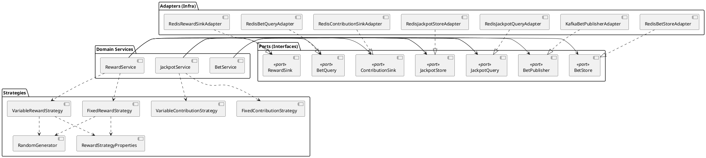

# Architecture Overview and Production Guidance

This document consolidates the system’s high‑level flow, key architectural decisions (ADRs), and a production‑hardening checklist tailored to this codebase.

---

## End‑to‑End Flow

Boot
- Spring Boot wires Kafka and Redis configurations, binds reward defaults from `application.yml`, and seeds jackpots from `src/main/resources/data/jackpots-seed.json` if missing.

Submit Bet (HTTP → Persist → Publish)
- Client POSTs `/api/bets`.
- `BetController` delegates to `BetService`.
- `BetService` persists via `BetStore` and publishes via `BetPublisher` (Kafka adapter).

Process Bet (Consume → Contribute → Persist)
- `BetConsumer` receives the bet from Kafka and calls `JackpotService.processBet`.
- `JackpotService` reads the jackpot via `JackpotQuery`, computes contribution via strategy, updates the pool, saves via `JackpotStore`, and appends a contribution via `ContributionSink`.

Evaluate Reward (HTTP → Decide → Payout/Reset)
- Client GETs `/api/jackpots/{betId}/evaluate`.
- `BetController` delegates to `RewardService`.
- `RewardService` reads the bet and jackpot via ports, selects a reward strategy, and uses `RandomGenerator` to decide a win.
- Win: calculates payout, appends reward via `RewardSink`, resets jackpot pool to `initialAmount` via `JackpotStore`, and returns reward JSON.
- No win: appends zero‑amount reward and returns.

Sequence (PlantUML)

Components (PlantUML)

---

## ADR Summaries

- Hexagonal Ports & Adapters (ADR 0001)
  - Goal: Decouple domain services from infrastructure via ports (`BetStore`, `BetPublisher`, `BetQuery`, `JackpotQuery`, `JackpotStore`, `ContributionSink`, `RewardSink`) and adapters (Kafka/Redis).
  - Pros: Swap tech without touching services; easier unit tests; clear responsibilities.
  - Cons: More classes/wiring; feels heavy on small apps.

- CQRS‑Lite Read/Write Split (ADR 0002)
  - Goal: Separate read (`*Query`) and write (`*Store`) concerns. Not advised for prototypes, used here only for demo purposes.
  - Pros: Independent permissions/access patterns/configuration/error handling/optimization/scaling; easy caches/projections.
  - Cons: Slight duplication when using same backend; mental overhead.

- Strategy Pattern for Business Rules (ADR 0003)
  - Goal: Pluggable contribution/reward logic (`Fixed`/`Variable`).
  - Pros: Open for extension; isolated rule changes; focused tests.
  - Cons: More classes; validation across strategies must live elsewhere.

- Config‑Driven Reward Defaults (ADR 0004)
  - Goal: Externalize defaults in `application.yml` via `RewardStrategyProperties`.
  - Pros: Tune per‑environment without redeploys; safer experiments.
  - Cons: Config drift; requires validation and docs.

- Randomness Abstraction (ADR 0005)
  - Goal: Inject `RandomGenerator` into strategies.
  - Pros: Deterministic tests; swappable RNG sources.
  - Cons: Extra indirection.

- Kafka for Bet Ingestion (ADR 0006)
  - Goal: Async pipeline (POST → produce; consume → update jackpots).
  - Pros: Decoupling; buffering/back‑pressure; scalable.
  - Cons: Eventual consistency; DLQ/retries/ops complexity.

- Redis as Primary Store, JSON (ADR 0007)
  - Goal: Fast/simple persistence for bets, jackpots, contributions, rewards.
  - Pros: Low latency; easy local setup; flexible schema.
  - Cons: No relational constraints; schema evolution care; durability depends on config.

- Java Time Serialization Module (ADR 0008)
  - Goal: Serialize `Instant` correctly in Redis.
  - Pros: Correct time handling.
  - Cons: Keep mapper configuration consistent.

- Seed Data on Startup (ADR 0009)
  - Goal: Ensure baseline jackpot(s) exist after boot.
  - Pros: Fast onboarding; reproducible environments.
  - Cons: Avoid unintended overwrites; lifecycle coupling.

- Thin REST Controllers (ADR 0010)
  - Goal: Minimal HTTP layer that delegates to services.
  - Pros: Separation; easy future transports (gRPC, GraphQL).
  - Cons: Minor indirection.

---

## Production‑Hardening Checklist

- Data Integrity
  - Replace `double` with `BigDecimal` for monetary values in models and strategy math.
  - Add bean validation (`@Valid`, JSR‑303) on request DTOs and a global `@ControllerAdvice` for error mapping.
  - Ensure atomic jackpot updates (transaction/Lua in Redis, or move to ACID DB for money).
  - Support idempotency keys on POST `/api/bets` to avoid duplicates.

- Messaging & Processing
  - Define schemas (Avro/gRPC + Schema Registry); version messages and validate both ends.
  - Add retry/DLQ with backoff on consumers; document delivery semantics; implement de‑duplication.
  - Consider outbox pattern if write+publish must be atomic.
  - Partition by `jackpotId` to preserve per‑jackpot ordering.

- Concurrency & Consistency
  - Guard pool updates/resets with a lock (e.g., Redis RedLock) or partitioned single‑thread consumption.
  - Compute payout and reset atomically to prevent lost updates.

- Persistence
  - Reassess Redis for production money flows:
    - Option A: Move canonical state to Postgres; use Redis as cache.
    - Option B: If staying on Redis, enable AOF (everysec), replication, durability monitoring.
  - Retain/TTL event lists or archive to analytics storage.

- Security
  - Remove broad Jackson default typing; restrict to explicit base types or avoid polymorphic typing entirely.
  - Externalize secrets to a secret manager; rotate regularly.
  - Add authN/Z (OAuth2/JWT), rate limiting, input sanitization.
  - PII handling policy; encryption in transit and at rest.

- Observability
  - Structured JSON logs with correlation/trace IDs across HTTP and Kafka.
  - Metrics (Micrometer): JVM, Kafka, Redis, business KPIs (pool sizes, win rate).
  - Distributed tracing (OpenTelemetry) across services.
  - Liveness/readiness probes and dependency health checks.

- Resilience
  - Configure timeouts/retries/circuit breakers (Resilience4j) around Kafka/Redis.
  - Graceful shutdown/drain for listeners; commit offsets on stop.
  - Backpressure controls and 429 responses for overloaded POSTs.

- API & Contract
  - OpenAPI spec with contract tests; versioned paths (`/api/v1`).
  - Idempotency on POST; consistent error model and status codes.

- Configuration & Ops
  - Validate `@ConfigurationProperties`; use profiles for env overrides.
  - Feature flags for strategy tweaks; canary/blue‑green rollouts.
  - Harden containers: distroless, non‑root, resource limits; tune JVM flags.
  - CI/CD with quality gates (static analysis, style), unit+integration (Testcontainers), and load tests.

- Domain & Fairness
  - If regulated, use verifiable RNG (e.g., HSM/VRF) and auditable draws.
  - Immutable, tamper‑evident logs for contributions/rewards.

- Scalability
  - Scale consumers by partitions; right‑size partition count.
  - Add read side caches/projections for hot jackpots.

- Codebase Hygiene
  - Replace `System.out` with proper logging.
  - Expand tests: property‑based tests for strategies, race tests for updates, end‑to‑end HTTP→Kafka→store.

---

## References
- Configuration: `src/main/resources/application.yml`
